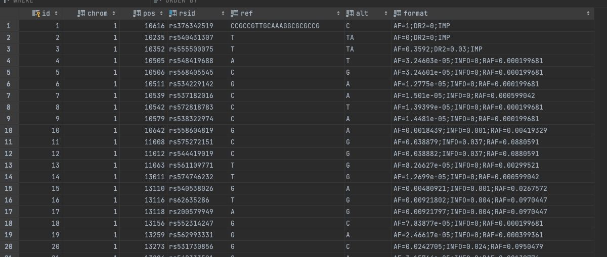
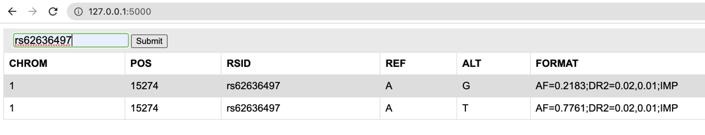
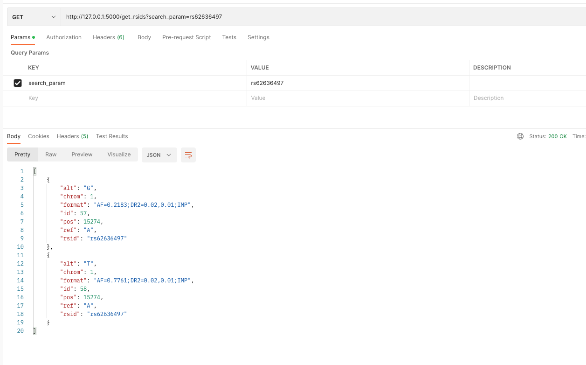

# Assignment

This project allows users to write something in the input box and when the  `search` button is pressed,the application
will try to find an `rsid` in the database that matches input.   
Assignment is built with Flask using `Python 3.9` and `SQLite` database.

## Prerequisites

Run `pip install -r requirements.txt` to install all dependencies needed to start this project. Also,
install `ajax jquery`.

## Start project

In project root, run `flask --app assignment run` and `flask --app assignment init-db` to start flask server, and to
create a table with data, respectively. After executing these two commands, visit `http://127.0.0.1:5000`.

### SQL Data

Data from `VCF` file are parsed with `read_data_and_create_sql_statments.py` script. This script reads the `VCF` file,
and from each line it creates sql insert statement in `sql_statements.sql` file. Those statements are later used in
adding data to the database.

To test `read_data_and_create_sql_statments.py` script, file `hg37variants1000g.vcf` must be added in `sql_data`
directory.
I have removed this file from commit, as it takes a lot of time to upload.

### Schema

Schema is written in `schema.sql` file. That file contains the table schema, with index and insert statements. Table
preview:

Note: First the index is created and only after that the data is inserted. Even if this is not the most efficient way,
it is written like this because of easier readability.

## Endpoints

Application contains two endpoints, both accepting only `GET` requests.

### Index Page `/`

Index page is where `search.html` is rendered. Page preview:

### Get rsids endpoint `/get_rsids`

An endpoint that accepts `GET` requests and reads `search_param` query parameter. It returns JSON with matching `rsid`.
Endpoint's response from postman:
